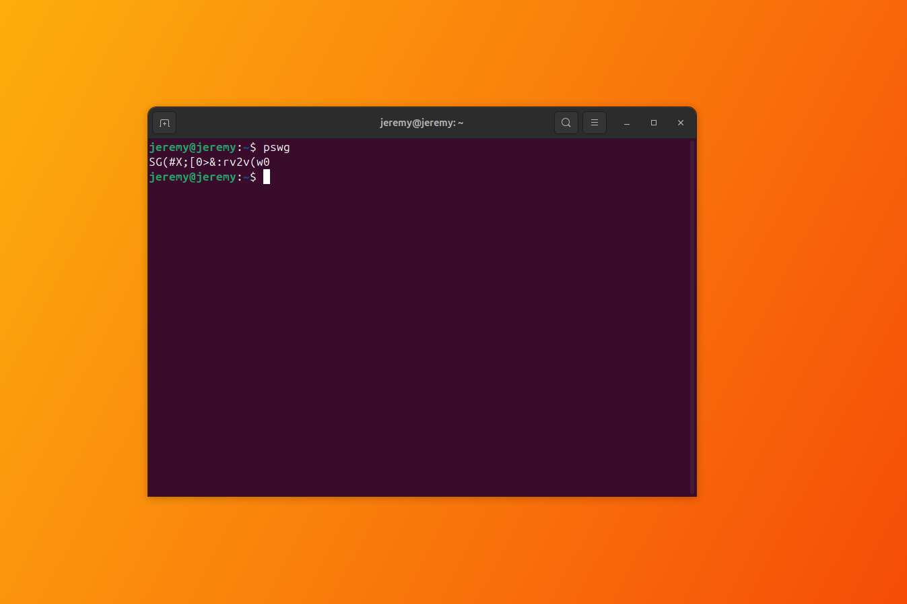

[](https://coveralls.io/github/JeremyMColegrove/pswg?branch=master)
# 🌟 pswg: Password Security with Grace

**PSWG** is a versatile and secure password generator designed for command-line use and integration into your Node.js projects using the crypto module. With PSWG, you can generate secure passwords with customizable options, including password length, character set control, and more from the command line or in your code.

### Key Features:

- **Secure Password Generation**: Generate passwords using cryptographically secure random values.
- **Customizable Length**: Specify the exact length of the password.
- **Character Set Control**: Include or exclude uppercase letters, numbers, and symbols.
- **Easy to Use**: Simple API for both command-line and programmatic usage.

## 🚀 Installation

To use it in the command line, install PSWG globally via npm:

`npm install -g pswg`

Or add it to your project dependencies:

`npm install pswg --save`

## 🛠 Getting Started

To generate a password, you can use the following simple commands:

### Command Line Usage

generate a secure password with default settings:

```bash
#generate a password with default settings:
pswg
#generate a 16-character password:
pswg --length 16
```

### Programmatic Usage

You can also use PSWG within your Node.js projects:

```javascript 
import pswg from 'pswg'
const password = pswg({ length: 16, excludeSymbols: true })
```

## 📸 Example



## 🌟 Why Choose PSWG?

PSWG offers a balance of simplicity and power, making it an ideal tool for developers and users alike who need secure, random passwords with customizable options.

## 🌍 Supported Environments

- **Node.js**: v12 and above
- **Command Line**: Compatible with all major operating systems

## 🎨 Customization

Customize your password generation with options:

- **Length**: Define the length of your password.
- **Exclude Symbols**: Option to exclude symbols.
- **Exclude Uppercase**: Option to exclude uppercase letters.
- **Exclude Numbers**: Option to exclude numbers.

### Example (with default options)
```javascript
import pswg from 'pswg'

const pw = pswg({
  length: 18, // the length of the password
  excludeSymbols: false, // exclude symbols from the password
  excludeUppercase: false,  // exclude uppercase letters
  excludeNumbers: false // exclude numbers
})
```

## 🔧 Command Line Usage

### Basic Usage

_generate a password with default settings:_

```
pswg
```

### Options

- **--length [length]**: Specify the length of the password. Default is 18 characters.
- **-es, --excludeSymbols**: Exclude symbols from the password.
- **-eu, --excludeUppercase**: Exclude uppercase letters from the password.
- **-en, --excludeNumbers**: Exclude numbers from the password.

### Version

_check the version of PSWG you are using:_

```bash
pswg --version
```

### Example Commands

_generate a 12-character password with no symbols:_

```bash
pswg --length 12 --excludeSymbols
```

### Combining Options

_generate an 8-character password using only lowercase letters and numbers:_

```bash
pswg --length 8 --excludeUppercase --excludeSymbols
```

## 🔧 Acknowledgments & Contributions

Contributions are welcome! If you have any suggestions or improvements, please feel free to submit a pull request or open an issue on GitHub.
